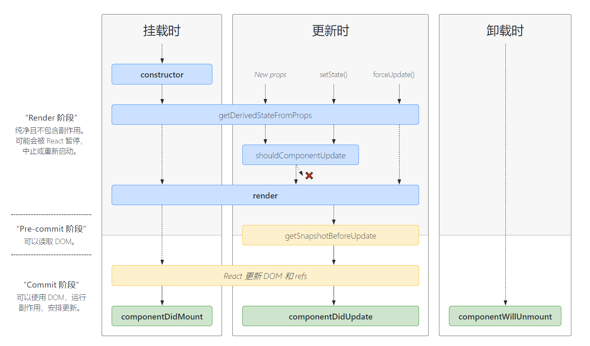

##### 1. setState

- 不得直接修改state，需要使用setState修改state

  ```javascript
  // 情况一
  this.state.count++; 	// 不允许
  // 情况二 
  // 虽然看起来没什么问题，但是push的时候list已经发生改变了
  this.setState({
      list:this.state.list.push(1) // 不允许
  })
  // 等价于
  this.state.push(1);
  this.setState({
      list:this.state.list
  })
  ```

- 同步|异步

  ```javascript
  // count 默认为 0 
  // 1. 在合成事件中(如 onClick) setState是异步的
  this.setState({
      count:this.state.count+1
  },()=>{
      // 回调函数相等于nextTick，可以获取到最新的值
      console.log(this.state.count) // 1
  });
  console.log(this.state.count); // 0
  
  // 2. 在生命周期(钩子)中是异步的
  componentDidMount(){
      this.setState({
      count:this.state.count+1
  });
  console.log(this.state.count); // 0
  }
  
  // 3. setState使用函数时，后续代码拿不到最新的值(异步)，但是每一次setState都是有效的，所以页面可以拿到最新值。
  this.setState((preState)=>{
      return {
          count:preState.count+1
      }
  })
  this.setState((preState)=>{
      return {
          count:preState.count+1
      }
  })
  console.log(this.state.count) // 0，同步获取不到最新值,但是页面上显示的是最新值(2);
  
  // 大胆的推断，setState在宏任务中是同步的
  // 4. setTimeout中 setState是同步的
  setTimeout(()=>{
      this.setState({
          count:this.state.count+1
      })
      console.log(count) // 1
  })
  
  // 5. 自定义的DOM事件中为同步
  document.body.addEventListener('click',()=>{
      this.setState({
          count:this.state.count+1
      })
      console.log(this.state.count) // 1
  })
  
  // 6. 在requestAnimationFrame中也是同步的
  requestAnimationFrame(()=>{
      this.setState({
          count:this.state.count+1
      })
      console.log(this.state.count); // 1
  })
  ```

  

- 多次执行setState时，是否会被合并

  ```javascript
  // 与setState的同步与异步有关
  // 1. 在setTimeout和自定义DOM中，setState是同步的，因此后续的setState获取的值就是最新的，每次操作都是有效的。
  // 2. 在方法中，setState是异步的，后续的setState获取的state都是旧的，所以只会以最后一次的setState为准。
  ```


##### 2.  生命周期




##### 3. Portals 传送门

```react
// 1. 基本使用 将元素传送到指定的DOM元素下 类似vue的teleport
ReactDOM.createPortal(
    <button>按钮</button>,
    document.getElementById('box'))

// 2. 注意点
// 2.1 指定的DOM元素必须已经挂载了,不然获取不到,在render函数中拿不到DOM元素(除了body和document)，所以挂载到别的DOM得用别的方式使用。
// 2.2 注意portal的事件冒泡，portal的事件冒泡并不会传递给传送后的父级DOM元素，而是按照代码中的父级进行冒泡。

// 3. 使用方式
// 3.1 方式一
// 通过自己创建一个DOM元素，然后将创建的portal挂载到该DOM上，然后再将这个DOM元素挂载到指定的DOM元素上。
// 3.2 方式二
// 可以将portal设置为一个变量，然后在componentDidMount生命周期中进行赋值，然后在render函数中进行渲染。
```

##### 4. context


##### 5. 异步组件

