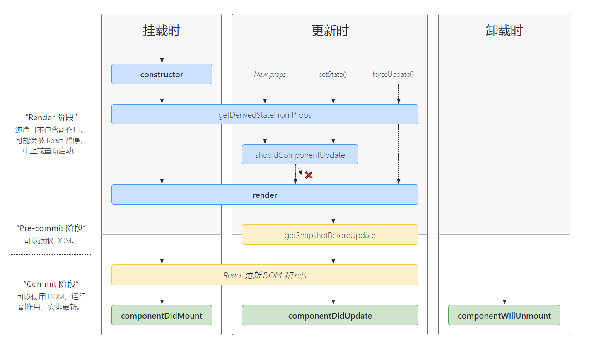

##### 0. JSX
Javascript XML - JS的语法扩展, 能够清晰准确的描述UI结构,并且在插入数据时会进行转译, 避免注入攻击(XSS),本质上调用了React.createElement(component, props, ...children)方法

jsx -> 经过@babel/preset-react变成JS对象 -> 传入React.createElement() -> ReactElement -> ReactDOM.render -> Fiber(stateNode属性就是对应的真实DOM)

##### 核心包
 - react: 包含react所必须的核心代码
 - react-dom: 将react渲染到不同平台(此处为渲染成真实DOM)所需要的核心代码
 - babel: 将jsx转换成JS对象并调用React.createElement()

##### 1. context
避免显示跨层级的props传递, 常用与如主题、地区的设置
```tsx
// theme-context.js
export const themes = {
  light: {
    foreground: '#000000',
    background: '#eeeeee',
  },
  dark: {
    foreground: '#ffffff',
    background: '#222222',
  },
};

export const ThemeContext = React.createContext({
  theme: themes.dark, // 默认值
	toggleTheme: ()=>{}, // 默认值
});

// themed-button.js
import { ThemeContext } from './theme-context';

class ThemedButton extends React.Component {
  static contextType = ThemeContext;
  render() {
    let props = this.props;
    let { theme, toggleTheme } = this.context;
    return (
      <button
        {...props}
				onClick={() => toggleTheme()}
        style={{backgroundColor: theme.background}}
      />
    );
  }
}
export default ThemedButton;

// App.js
import {ThemeContext, themes} from './theme-context';
import ThemeTogglerButton from './theme-toggler-button';

class App extends React.Component {
  constructor(props) {
    super(props);

    this.toggleTheme = () => {
      this.setState(state => ({
        theme:
          state.theme === themes.dark
            ? themes.light
            : themes.dark,
      }));
    };

    // State 也包含了更新函数，因此它会被传递进 context provider。
    this.state = {
      theme: themes.light,
      toggleTheme: this.toggleTheme,
    };
  }

  render() {
    // 整个 state 都被传递进 provider
    // 也可以使用Context.Consumer的形式
    return (
      <ThemeContext.Provider value={this.state}>
        <ThemeContext.Consumer>
          {value=>{}}
        </ThemeContext.Consumer>
        <Content />
      </ThemeContext.Provider>
    );
  }
}

function Content() {
  return (
    <div>
      <ThemeTogglerButton />
    </div>
  );
}

ReactDOM.render(<App />, document.root);
```


##### 2. Refs转发
可以获取组件内部的某个组件实例(函数组件没有实例,无法使用ref)
```tsx
// 不使用转发, 无法获取FancyButton中的button组件的实例
const FancyButton = React.forwardRef((props, ref) => (
  <button ref={ref} className="FancyButton">
    {props.children}
  </button>
));

// 你可以直接获取 DOM button 的 ref：
const ref = React.createRef();
// 注意, ref并不会作为prop进行传递
// 如果FancyButton没有使用forwardRef, ref就指向FancyButton实例
<FancyButton ref={ref}>Click me!</FancyButton>;
```
- 我们通过调用 React.createRef 创建了一个 React ref 并将其赋值给 ref 变量。
- 我们通过指定 ref 为 JSX 属性，将其向下传递给 \<FancyButton ref={ref}>。
- React 传递 ref 给 forwardRef 内函数 (props, ref) => ...，作为其第二个参数
- 我们向下转发该 ref 参数到 \<button ref={ref}>, 将其指定为 JSX 属性
- 当 ref 挂载完成，ref.current 将指向 \<button> DOM 节点。

##### 3. Fragment 
允许你将子列表分组，而无需向 DOM 添加额外节点
```tsx
// 写法一
<React.Fragment></React.Fragment>

// 写法二
<></>
```

##### 4. 逻辑复用 
###### High Order Component (HOC) 高阶组件
接收一个组件返回一个新的组件的函数, 在HOC中可以对组件进行扩展(如传递props、扩展生命周期),封装通用逻辑,使这部分通用逻辑能够被复用, 如 Redux的Connect
```jsx
// 正向属性代理
const hoc= (Component)=>{
  // 也可以返回函数组件
	class updateComponent extends React.Component{
		render(){
			return <div>
				<Component {...this.state} {...this.props}></Component>
			</div>
		}
	}
	return updateComponent;
}

// 使用
function Child(){
	return <div>Son</div>
}

// 避免在render中使用HOC, 因此每次render都会导致这个HOC重新执行,组件就不是之前创建的组件了，也就无法复用了
const HOC = hoc(Child);
function App(){
	return (<>
		<HOC></HOC>
	</>);
}

// 注意点：
// 1. 外部添加了一层外壳, 所以无法直接通过ref获取到原组件的实例, 需要借助 forwardRef
// 2. 返回新的组件, 丢失原本类组件的静态属性
// 3. 命名可能会冲突


```


###### Render Props
```jsx
function Test(props){
  let { render } = props;
  let title='Render Props';
  return <div>
    {render(title)}
  </div>
}
// 通过传递函数组件(名字任意,此处叫render),然后子组件通过props获取到这个函数组件并传参使用。(此处的感觉有点像插槽,并且和普通复用组件逻辑相似)
export default function RenderProps(){
  return <div>
    <Test render={(value)=><h1>{value}</h1>}></Test>
  </div>
}
```

##### 5. 性能优化

###### 根据props是否发生改变来控制组件是否更新
```jsx
// 前情提要:
// 在react中，父组件更新时，所有子组件都会触发更新
// 1. shouldComponentUpdate
shouldComponentUpdate(nextProps, nextState) {
    // 在此处可以比较props和nextProps，state和nextState 
    // 当返回false的时候 组件不更新 返回true 组件更新
    return true;
}

// 2. PureComponent
class MyComponent extends React.PureComponent{}

// 3. memo
function MyComponent(props) {
  /* 使用 props 渲染 */
}
function areEqual(prevProps, nextProps) {
  /*
  如果把 nextProps 传入 render 方法的返回结果与
  将 prevProps 传入 render 方法的返回结果一致则返回 true，
  否则返回 false
  */
}
// 当不传入areEqual函数时，默认进行浅层比较，即只比较props第一层属性
export default React.memo(MyComponent, areEqual);
```

###### 当函数作为props传递时, 需要注意这个函数不能根据组件渲染而重新创建, 否则会导致使用该函数的子组件更新(哪怕使用了PureComponent或者memo,因此函数重新创建了)

###### 父组件更新导致子组件重复渲染
```jsx
// <Son />这个写法会导致React.createElement(Son)重新创建, 所以每次打props都不一样,所以更新
<Parent>
  <Son />
</Parent>

```


##### 6. Portals
```jsx
// 1. 基本使用 将元素传送到指定的DOM元素下 类似vue的teleport
ReactDOM.createPortal(
    <button>按钮</button>,
    document.getElementById('box'))

// 2. 注意点
// 2.1 指定的DOM元素必须已经挂载了,不然获取不到,在render函数中拿不到DOM元素(除了body和document)，所以挂载到别的DOM得用别的方式使用。
// 2.2 注意portal的事件冒泡，portal的事件冒泡并不会传递给传送后的父级DOM元素，而是按照代码中的父级进行冒泡。

// 3. 使用方式
// 3.1 方式一
// 通过自己创建一个DOM元素，然后将创建的portal挂载到该DOM上，然后再将这个DOM元素挂载到指定的DOM元素上。
// 3.2 方式二
// 可以将portal设置为一个变量，然后在componentDidMount生命周期中进行赋值，然后在render函数中进行渲染。
```


##### 7. setState
- 不可变性
通过setState修改state, 因此经常需要对state上的对象进行拷贝, 常用的有扩展运算符(...)和Object.assign()以及 immer.js
```tsx

this.setState({
  user: {
    ...this.state.user,
    title: 'React', // 修改
  }
});

```

- 不得直接修改state，需要使用setState修改state
```javascript
// 情况一
this.state.count++; 	// 不允许, 不具备相应式

// 情况二 
// 虽然看起来没什么问题，但是push的时候list已经发生改变了并且由于在setState时，list已经发生改变，所以setState前后的list是相等的，这样的话使用PureComponent和React.memo会导致组件不更新
this.state.list.push(+new Date())
this.setState({
		list:this.state.list // 不允许
})
```

- 同步 | 异步
```javascript
// count 默认设置为 0 
// 1. 在合成事件中(如 onClick) setState是异步的, 也就是进行了批处理
this.setState({
		count:this.state.count+1
},()=>{
		// 回调函数相等于nextTick，可以获取到最新的值
		console.log(this.state.count) // 1
});
console.log(this.state.count); // 0

// 2. 在生命周期(钩子)中是异步的
componentDidMount(){
	this.setState({
		count:this.state.count + 1
	});
	console.log(this.state.count); // 0
}

// 3. setState使用函数时，后续代码拿不到最新的值(异步)，但是每一次setState都是有效的，所以页面可以拿到最新值
this.setState((preState)=>{
	return {
		count:preState.count + 1
	}
})
this.setState((preState)=>{
	return {
		count:preState.count + 1
	}
})
console.log(this.state.count) // 0，同步获取不到最新值,但是页面上显示的是最新值(2);

// 大胆的推断，setState在异步任务中是同步的
// 4. setTimeout中 setState是同步的
setTimeout(()=>{
		this.setState({
				count:this.state.count + 1
		})
		console.log(count) // 1
})

// 5. 自定义的DOM事件中为同步
document.body.addEventListener('click',() => {
		this.setState({
				count:this.state.count + 1
		})
		console.log(this.state.count) // 1
})

// 6. 在requestAnimationFrame中也是同步的
requestAnimationFrame(()=>{
	this.setState({
		count:this.state.count+1
	})
	console.log(this.state.count); // 1
})

// Promise中也是同步的
```

- 多次执行setState时，是否会被合并
```javascript
// 与setState的同步与异步有关
// 1. 在setTimeout和自定义DOM中以及微任务中，setState是同步的，因此后续的setState获取的值就是最新的，每次操作都是有效的。
// 2. 在方法中，setState是异步的，后续的setState获取的state都是旧的，所以只会以最后一次的setState为准。
```


##### 8. 生命周期



```jsx
// 一、组件挂载阶段
// 1. constructor() 构造函数阶段
// 构造函数主要用于初始化state和为方法绑定this执行 如果不需要 可以不用写构造函数 并且不要调用setState方法 构造函数可以直接初始化state并且需要在其他语句前调用super(props)。

// 2. static getDerivedStateFromProps(props,state) 生命周期的名字翻译过来就是：从props中衍生出state
// 在初次渲染和后续更新中都会触发，返回一个对象来更新state，返回null则不更新。
// 可以用于将props映射到state上(组件不允许修改传入的props，所以根据需求，有时需要将props映射至state上)

// 3. render() 渲染函数 必须实现 纯函数
// 在渲染函数中不得使用setState，因为setState会不断触发render，会导致页面不断的更新，无法正常显示。
// 返回值:JSX、数组、fragments、Protals、字符串和数值、布尔和nul


// 5. componentDidMount() 组件挂载完毕时触发
// 和浏览器的交互需要在这个生命周期中定义，因为这是组件才挂载完毕，其他生命周期时，组件还没有挂载，也就无法操作DOM。
// 官方推荐网络请求放在这个生命周期

// 二、组件更新阶段
// 1. static getDerivedStateFromProps(props, state) 同挂载阶段。

// 2. shouldComponentUpdate(nextProps, nextState)
// 重点：常用于性能优化，返回true时，组件更新，返回false，阻止组件更新。
// 通过对比props和state前后变化，决定返回true还是false来优化性能。
// 可以使用forceUpdate强制更新组件，但是子组件的更新照常。


// 4. render()

// 5. getSnapshotBeforeUpdate(prevProps, prevState)
// 必须配合componentDidUpdate使用，否则会报错
// componentDidUpdate前调用，返回值作为componentDidUpdate的第三个参数

// 6. componentDidUpdate(prevProps, prevState, snapshot) 组件更新后触发，首次加载不会触发 
// 这个生命周期也不允许直接setState，需要附加条件，避免重复触发。
// 接收更新前的props和state，第三个参数为getSnapshotBeforeUpdate的返回值，如果没有，则为undefined

// 三、组件卸载时
// 1. componentWillUnmount()
// 组件卸载以及销毁时触发，主要做清理操作，如清除定时器、取消网络请求和清除订阅监听等。

// 四、异常边界
// 1. static getDerivedStateFromError(error)
// 此生命周期会在后代组件抛出错误后被调用。 它将抛出的错误作为参数，并返回一个值以更新 state(可以用来控制页面显示)
// 降级UI,即当发生异常时，显示别的内容，

// 2. componentDidCatch(error, info)
// error —— 抛出的错误。
// info  —— 带有 componentStack key 的对象，其中包含有关组件引发错误的栈信息。
// 可执行副作用，记录错误情况。
// 开发模式：错误会冒泡至window，即错误会被根错误处理机制捕获。
// 生产模式：只会没有被处理的错，才会被根错误处理机制捕获。


// 废弃的生命周期
// 1. UNSAFE_componentWillMount() 16版本会报警告,17版本报异常 不建议使用
// 2. UNSAFE_componentWillUpdate(nextProps, nextState) 16版本会报警告,17版本报异常 不建议使用
// 3. UNSAFE_componentWillReceiveProps() 16版本会报警告,17版本报异常 不建议使用
// 原因: 这些生命周期处于render之前, 在Fiber架构下, 任务是可以被打断的, 可能会导致多次执行
```


##### 9. 异步组件
```jsx
// 1. import ();
// 2. React.lazy(import());
// 3. Suspense
```

##### 10. Hooks
hooks使函数组件具有的自己的状态和生命周期, 相比于类组件, hooks更加灵活, 类组件中无法通过功能将代码进行拆分,如生命周期函数中往往包含了很多不同的功能逻辑, 而hooks可以将代码进行拆分,每个部分都可以具备自己的state和生命周期

###### 优势
 - 无需关注this
 - 可以功能逻辑分离,即每个功能都能够拥有自己的state和生命周期

###### 使用规则
 - 不要在循环，条件或嵌套函数中调用 Hook， 确保总是在你的 React 函数的最顶层以及任何 return 之前调用他们,这样可以保证Hook的顺序
 - 只在 React 函数中调用 Hook

```jsx
// 1. useState
// useState返回一个数组 [0]是值 [1]是设置值的函数
const [count,setCount]=useState(0);
// setCount无论在哪执行,都会进行批处理,表现形式类似异步, 无法直接获取修改后的count
// 这也是跟setState不太相同的点

// 2. useEffect
// 监听state改变,在DOM更新完毕后,组件重新渲染后执行(浏览器完成布局和绘制后),不会阻塞页面布局/绘制
// 第一个参数回调,第二个参数是依赖(依赖改变,触发回调)
// 在useEffect中修改state,会导致浏览器重新布局/绘制, 可能导致闪烁
// 可以返回函数, 该函数在清除effect时执行,并且每次执行effect都会清除上一个effect
// 2.1 模拟componentDidUpdate 不接收依赖
// 2.2 模拟componentDidMount 接收依赖为[]
// 2.3 接收依赖为[],并且回调函数返回一个函数,该函数在组件卸载时触发

// 3. useLayoutEffect
// 在DOM更新完毕后,组件重新渲染前执行(浏览器完成布局和绘制前)，会阻塞页面布局/绘制
// 相当于生命周期 componentDidMount 和 componentDidUpdate 

// 4. useContext  共享上下文
// 先创建一个全局的context
// const MyContext = createContext({
//    theme:'dark'
// })
// 然后通过 const context = useContext(MyContext);获取

// 5. useMemo  类似于计算属性 
// 接收回调函数和依赖 依赖发生改变时重新计算值(有缓存)
// 不提供依赖数组时，每次渲染都会重新获取值
// let countStr=useMemo(()=>{
// 		return `计数:${count}`;
// },[count])

// 5. useRef 返回一个可变的ref对象 其.current被传入参数初始化
// 返回的ref对象在组件生命周期保持不变 还可以用来获取DOM元素
// let child=useRef(); // 需要在didMount才能拿到
// <Child ref=child></Child>

// useRef和createRef不同
// useRef的值不会发生改变，而createRef每次返回新的引用

// useRef和useState异同 
// useRef和useState都会声明一个数据并在在render中不重置
// useRef的current改变不会触发render,但是useState会

// 6. useReducer  类似于redux
// const initialState={count:0};   // 初始值
// 纯函数 根据action 改变state
// function reducer(state, action) {
//   switch (action.type) {
//     case 'increment':
//       return {count: state.count + 1};
//     case 'decrement':
//       return {count: state.count - 1};
//     default:
//       throw new Error();
//   }
// }
// const [state,dispatch]=useReducer(reducer,initialState);
// 通过 dispatch({type:'increment'})使用

// 7. useCallback 返回缓存过的回调函数 这个函数只有在依赖发生改变时才会重新创建
// 因为默认情况下,函数组件重新渲染的时候 其中的函数都会重新创建
// 可以传递一个空的数组,该函数就会被缓存 而非重新创建
// 注意: useCallback中的依赖的值就是上一次创建的时候的值, 所以依赖发生改变时,需要重新创建,避免使用了旧的值
// 应用场景/解决的问题: 父组件是一个函数组件时,其中定义的方法在每次重新渲染的时候都会重新创建方法，尤其是当这个方法会传递给子组件的时候,会导致子组件的更新
// const memoizedCallback=useCallback(()=>{
// 		doSomething(count)
// },[count])

// 8. useImperativeHandle
// 与forwardRef一起使用, 控制暴露给父组件的实例(不暴露整个ref)
function FancyInput(props, ref) {
  const inputRef = useRef();
  useImperativeHandle(ref, () => ({
    focus: () => {
      inputRef.current.focus();
    }
  }));
  return <input ref={inputRef} {...props} />;
}
FancyInput = forwardRef(FancyInput);

// 9. useDebugValue(value)
// useDebugValue用于在React开发者工具中显示自定义hook
```

###### 原理
 - hook的实现是通过环形单向链表实现的,必须确保hooks的顺序,这也是为什么hooks必须在顶层而不能在循环、条件中使用的原因


##### 11. 受控组件和非受控组件
受控组件: 组件状态受state和方法控制
```tsx
function Com(){
    const [value, setValue] = useState('');
    const handleChange = (e) => setValue(e);
    return (<div>
        <input value={value} onChange={handleChange}>
    </div>)
}

```

非受控组件: 组件状态不受state控制,由用户操作决定
```tsx
// 无法通过state控制input的value, 仅通过ref获取值
<input type="file" ref={this.file} />
```

##### 12. React组件通信方式
- props以及传递回调函数
- context
- 事件总线
- redux 、 mobx 第三方库


##### 15. React的合成事件
React合成事件是原生事件的跨浏览器包装器

###### 事件绑定
 - 执行diff时,判断props是否是合成事件
 - 如果是合成事件则查找该合成事件依赖的原生事件,判断事件是否已经注册到根组件(17版本是根节点, 16版本是document,document在微前端时可能会产生问题)
 - 若还没注册,则注册到根节点上, 函数为dispatchEvent,也就是分发事件

###### 事件触发
 - DOM触发事件, dispatchEvent执行
 - 根据触发的真实DOM找到对应的Fiber节点和函数进行触发,并且会进行冒泡
 - 冒泡是通过event.target的parentNode找到上级的DOM节点,再触发它的事件,不断的冒泡


###### 注意点
- 合成事件中return false并不会阻止浏览器的默认事件, 因为这个函数传入后续被触发只是执行了, 并不会直接作为event触发的函数
```html
<script>
	document.body.addEventListener('click', ()=>{
		// 可以看出在事件触发后调用了我们传入的函数, 但是这个函数的return false并不会影响事件的默认行为, 这个handle接收event事件作为参数, 可以通过event.preventDefault()阻止默认行为
		handle(); 
	})
</script>
```

- 合成事件接收函数后进行调用,使用的是默认绑定规则,即指向全局对象,因此需要使用bind或者箭头函数
```jsx
// 1. 箭头函数定义方法
// click: ()=>{} 
// 2. 调用时使用箭头函数
// onClick={()=>{ fn() }}
// 3. 构造函数中绑定this
// constructor(){
//   this.click = this.click.bind(this);
// }
// 由上述代码可见，this.click并没有加(),所以只是将这个方法的引用给了onClick，并没有马上调用,下次onClick调用时使用的是默认绑定规则,即this指向全局对象

// 实例代码
// let obj={
// 		run(){console.log(this)}
// }
// obj.run();  // obj
// let run=obj.run();
// run();      // 浏览器window,node中globalThis
```
- 合成事件能够兼容所有浏览器
- 合成事件都绑定在根节点,避免绑定原生事件,在事件触发时通过合成事件的机制进行分发,内存消耗更小,并且通过对象池管理合成对象的创建和销毁,提高性能
- 合成事件中会进行批量优化, setState在合成函数中是异步,多次设置仅执行一次

##### 16. Redux相关概念

##### 17. React 18 了解

###### batch update - 批量更新
在18版本前,react在 - batch update: 批量更新state,即便在异步中,同样会将多次setState合并成一次, flushSync(()=>{ 不需要批处理的代码 })
```

```
 - startTransition: 渲染可中断并且可以设置优先级, const [ isPedding, startTransiton ] = useTransition();
 - 严格模式会对组件进行两次渲染, 17版本时做了限制,取消了一次渲染的日志

###### Concurrent Renderer
并发渲染模式: 帮助应用保持响应，并根据用户的设备性能和网速进行适当的调整，该模式通过使渲染可中断来修复阻塞渲染限制
 ```jsx
 ReactDOM.createRoot(root).render(<App />);
 ```

###### 渲染任务
一般将状态更新的分为两类:
 - 紧急更新任务: 比如一些用户交互行为，按键，点击，输入等
 - 过渡更新任务: 比如 UI 从一个视图过渡到另外一个视图

```jsx
// 传入的回调函数中的更新任务将会被作为过渡更新任务处理, 优先级较低
const [value, setValue] = useState('');
startTransition(()=>{
   /* 更新任务 */
   setValue('')
});


// 新增hook
const [ isPending , startTransition ] = React.useTransition()
```

###### 19. React流程
React


###### 18. diff算法和key的作用


###### 20. 严格模式
 - 严格模式会进行2次渲染, 17版本会限制控制台(console),使其2次渲染只打印一次, 但是像alert就不受限制
 - 用途: 
  - 识别不安全的生命周期
  - 使用废弃的API或方法时警告
  - 检测不安全的副作用

##### API

###### React.Component
React类组件的基类, 必须包含render函数, 
 - 实例属性: props、state、
 - 实例方法: setState、forceUpdate
 - 静态方法: defaultProps、displayName
 - 生命周期: ...
