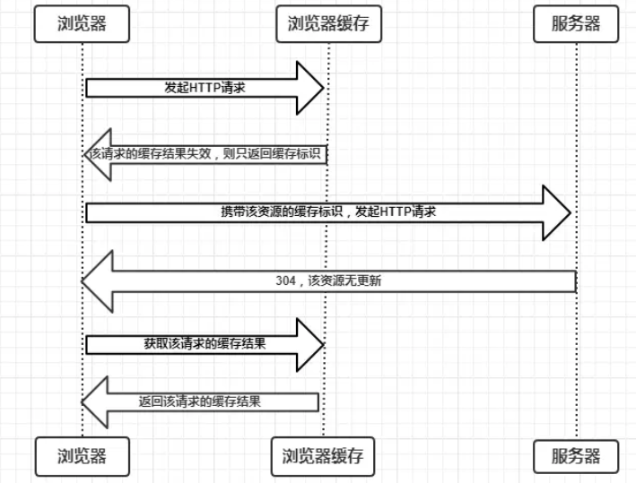

#### 1. 前言

浏览器向服务器获取资源，可分为 发起请求、服务器响应、浏览器接收三个步骤。浏览器的缓存可以帮助我们优化性能。比如: 直接使用缓存,不向后端发送请求(强缓存) 或者 向后端发起请求但是后端的数据未改变，此时再使用缓存的数据,后端无需返回数据(协商缓存)。

#### 2. 缓存位置
1. Service Worker: 基础web worker,开辟新的浏览器的独立线程，传输协议必须是HTTPS，因为涉及请求拦截。由用户注册控制缓存哪些文件以及如何匹配文件。

2. Memory Cache：内存中的缓存，高效但持续性低，随着进程释放而释放,即关闭Tab页面，内存的缓存就被释放了。小文件优先内存，当内存使用率高时，优先存入硬盘。

3. Disk Cache: 硬盘中的缓存，读取稍慢，但是容量大、持续时间长。

4. Push Cache: 推送缓存(HTTP2)，当以上三种都没有命中时，才被使用。会话结束就会释放。

#### 3. 强缓存
强缓存:不会向服务器发送请求，直接从缓存中读取资源，该请求返回 200状态码并且Size显示form disk cache或from memory cache。 通过设置HTTP Header实现：Expires和Cache-Control。

浏览器向服务器请求资源后, 服务器会返回Expire或者Cache-Control并缓存资源, 下次发送请求时,和缓存中的资源进行对比,如果资源有效期没过,直接使用

1. Expires： 缓存过期时间,指定资源到期时间，Expires=Time

2. Cache-Control: 相对时间，解决expires的问题，优先级高于Expires。
  - no-cache: 并不是不会做缓存,而是每次使用的时候都需要像服务器验证缓存的有效性,避免使用过期的资源
  - 当取值为max-age时,如果是HTTP/1.1版本,则忽略Expires, HTTP/1.0忽略max-age

#### 4. 协商缓存
当强缓存失效后，浏览器携带缓存标识向服务器发送请求，服务器根据缓存标识决定是否使用缓存。

1. 协商缓存生效，返回304和 Not Modified

2. 协商缓存失效，返回200和请求结果

**协商缓存的两种实现方式**

- Last-Modified 和 If-Modified-Since

  浏览器第一次获取资源时，响应头中携带 Last-Modified，这个值是资源在服务器上的最后修改时间，浏览器接收后缓存，浏览器再次请求该资源，发现请求头中有Last-Modified，于是携带 If-Modified-Since,值与Last-Modified一致，服务器接收到后，判断这个时间和服务器中该资源的最后修改时间是否一致从而判断资源是否改变，如果没有改变，返回304和Not Modified,浏览器直接从缓存读取，如果If-Modified-Since小于服务器的资源最后修改时间，则资源发送改变，返回新的资源和状态码200。

  问题：本地打开缓存文件，会改变Last-Modified，导致无法命中缓存，并且Last-Modified以秒对单位，对不可感知的时间内修改文件，资源还会命中。

- ETag和If-None-Match

  ETag是由服务器响应时，返回当前资源文件的唯一标识(服务器生成)，只有当资源发生改变，ETag才会重新生成。浏览器再次请求时，将上一次的ETag放到If-None-Match中，服务器根据比较资源的ETag和请求头中的If-None-Match，判断资源是否被修改过。如果未修改过，则返回304告知浏览器使用缓存，修改过则返回200和新的资源。

- ETag和Last-Modified对比

  - 准确性上,ETag优于Last-Modified。
  - 性能上，Last-Modified优于ETag，因为只需要存储时间，ETag需要计算。
  - 优先级上，浏览器校验优先使用ETag
  - 高频率修改时, Last-Modified只能精确到秒
  - 不修改内容, 如仅修改时间改变,此时ETag更合适

#### 5. 缓存过程分析

**强制缓存优先于协商缓存进行，若强制缓存(Expires和Cache-Control)生效则直接使用缓存，若不生效则进行协商缓存(Last-Modified / If-Modified-Since和Etag / If-None-Match)，协商缓存由服务器决定是否使用缓存，若协商缓存失效，那么代表该请求的缓存失效，返回200，重新返回资源和缓存标识，再存入浏览器缓存中；生效则返回304，继续使用缓存**。

#### 6. 最佳实践
现在比较常见的做法是将Expires或Cache-Control设置的非常久，直接让资源命中强缓存，再加上现在的打包工具，如Webpack等，生成的资源名可以附上hash值，因此资源发生改变时，文件名也会变化，这样浏览器就会请求新的资源。

